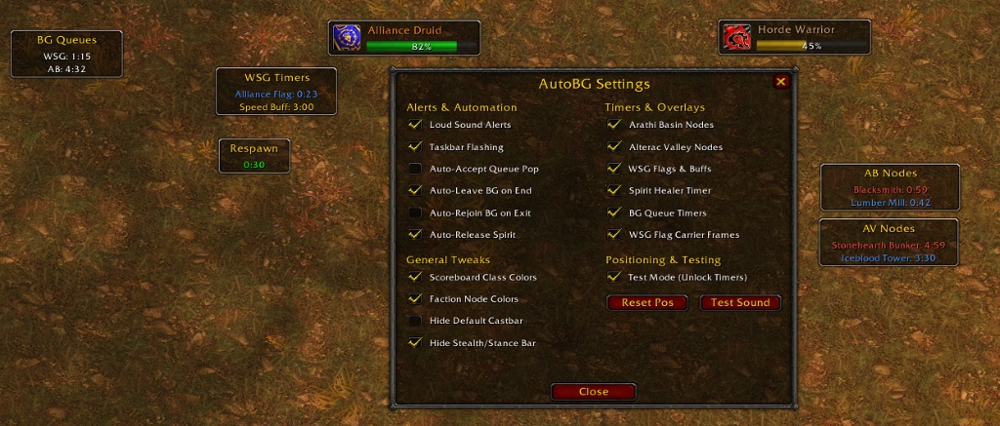

# AutoBG

[](https://github.com/fostercare123/AutoBG/releases)
[](https://github.com/fostercare123/AutoBG)
[](https://github.com/fostercare123/AutoBG)

High-performance PvP automation and timer engine for World of Warcraft **Vanilla 1.12.1** and modern enhanced clients (OctoWOW / SuperWoW).

---

## 📸 Preview



---

## ⚙️ Architecture & Performance

- **Zero-Delay Execution (0ms)**: Queue confirmations, match exit calls, and battleground queueing execute on the first frame of receipt.
- **Throttled Update Loops**: Core timers update at 10 Hz (`0.1s`), FC unit scanner at 5 Hz (`0.2s`). Prevents CPU spikes and memory garbage accumulation.
- **Direct Frame Indexing**: Direct integration with OctoWOW/Turtle UI elements (`TWMiniMapBattlefieldFrame` -> `DropDownList1Button[3-7]`) eliminating dynamic UI tree traversal overhead.
- **Memory Footprint**: Minimal heap allocation, stateless timer calculations via `GetTime()`, zero background table churn.

---

## ⚡ Core Modules

### 1. Automation & Queue Engine
- **Instant Match Exit**: Calls `LeaveBattlefield(0)` immediately upon match end detection.
- **0ms Auto-Rejoin**: On zoning out of a battleground, directly queues into the next match via Battleground Finder.
- **Auto-Accept & Delay**: Confirms queue pop instantly (0s) or after a configurable countdown (0–30s).
- **Smart Spirit Release**: Auto-releases spirit inside battlegrounds while preserving Soulstones and Reincarnation (Ankh).
- **Audio & Taskbar Alerts**: Ready-check audio triggers and OS taskbar flashing on queue pop.
- **Chat Notifications**: Color-coded system status messages for queues, joins, delayed entries, and leaves.

### 2. Objective & Base Timers
- **Arathi Basin**: 60s node capture timers with faction color-coding (Horde / Alliance). Supports all standard combat log aliases (`"the mine"`, `"the mill"`).
- **Alterac Valley**: 300s capture timers for bunkers, towers, and graveyards.
- **Warsong Gulch**: 23s flag respawn timers with faction color-coding (Alliance / Horde). Strictly zone-isolated.
- **Gate Openings**: Universal pre-match countdowns (120s, 60s, 30s, 15s).

### 3. Server-Synchronized Spirit Healer Engine
Synchronizes the global 30-second server resurrection wave with a live visual progress bar:
1. **Server Clock Heartbeat**: Continuous tracking aligned to `GetBattlefieldInstanceRunTime()`.
2. **Ground-Truth Calibration**: Exact phase lock via `GetAreaSpiritHealerTime()` and `PLAYER_UNGHOST`.
3. **Color-Graded Status Bar**: Smooth draining bar transitioning Green (>10s) -> Yellow (5-10s) -> Orange (2-5s) -> Red (<=2s).

### 4. Warsong Flag Carrier (FC) Tracking
- Targetable unit frames for friendly and enemy carriers.
- Scoreboard and raid cache class-color resolution.
- Live HP status bar scanned at 5 Hz.

### 5. UI Tweaks
- **Scoreboard Colors**: Class-colored player entries with realm suffix removal.
- **Stance / Stealth Bar**: Suppresses default `ShapeshiftBarFrame` and child action buttons.
- **Draggable Frames**: Position persistence across all timer displays via `/abg test`.

### 6. Interactive Chat Announcements
- **CTRL + Left-Click**: Click any live timer (AB/AV node, WSG flag respawn, Spirit Healer wave, or queue wait time) to instantly broadcast its remaining time into **Battleground chat** (or Party/Raid).

---

## ⌨️ Commands & Macros

### Shortcuts & Click Actions

| Action | Result |
| :--- | :--- |
| `CTRL + Left-Click` on Timer | Broadcast timer countdown to Battleground / Raid chat |
| `Left-Click Drag` on Frame | Move timer frame position (saved across sessions) |

### Slash Commands

| Command | Action |
| :--- | :--- |
| `/abg` | Toggle graphical configuration panel |
| `/abg q` | Queue for last played battleground |
| `/abg q ab` | Queue for Arathi Basin |
| `/abg q wsg` | Queue for Warsong Gulch |
| `/abg q av` | Queue for Alterac Valley |
| `/abg q tg` | Queue for Thorn Gorge |
| `/abg a` | Toggle Auto-Accept queue pop |
| `/abg delay <sec>` | Set Auto-Accept delay (0=instant, up to 30s) |
| `/abg msg` | Toggle chat status notifications |
| `/abg l` | Toggle Auto-Leave on match end |
| `/abg j` | Toggle Auto-Rejoin on zone exit |
| `/abg r` | Toggle Auto-Release on death |
| `/abg c` | Toggle Scoreboard class colors |
| `/abg stealth` | Toggle Stealth / Stance bar suppression |
| `/abg s` | Toggle Sound notifications |
| `/abg f` | Toggle Taskbar flashing |
| `/abg test` | Toggle test mode to reposition all frames |
| `/abg reset` | Reset configuration and frame positions |

### 1-Click Action Bar Macro
```text
/click AutoBG_QuickQueueButton
```
*Or:*
```text
/abg q
```

---

## 📦 Installation

1. Download the latest release from the [Releases](https://github.com/fostercare123/AutoBG/releases) page.
2. Place the `AutoBG` directory into:
   ```text
   World of Warcraft/Interface/AddOns/AutoBG/
   ```
3. Verify folder structure: `Interface/AddOns/AutoBG/AutoBG.toc` must be valid.
4. Enable **AutoBG** in the in-game AddOn manager.

---

## 📄 License

MIT License - Developed by **[fostercare123](https://github.com/fostercare123)**. See [LICENSE](LICENSE) for details.


